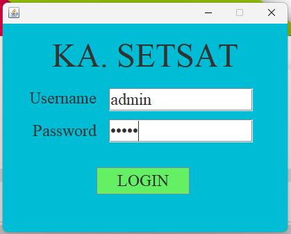
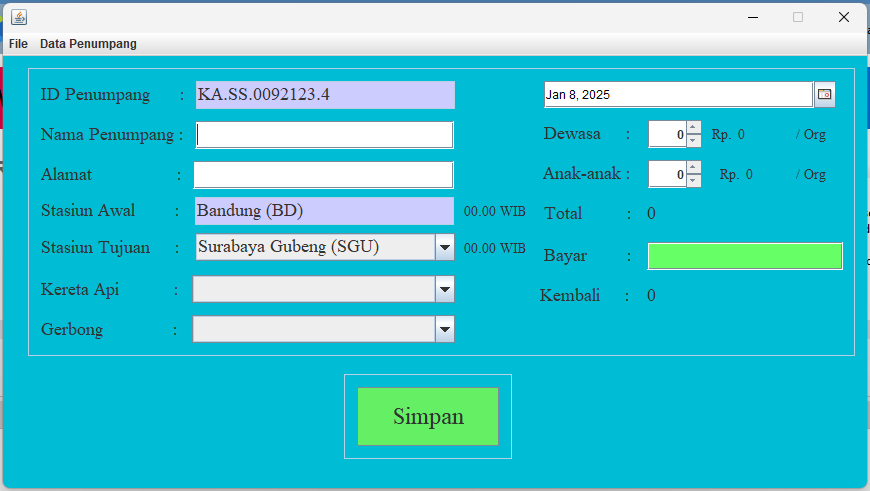
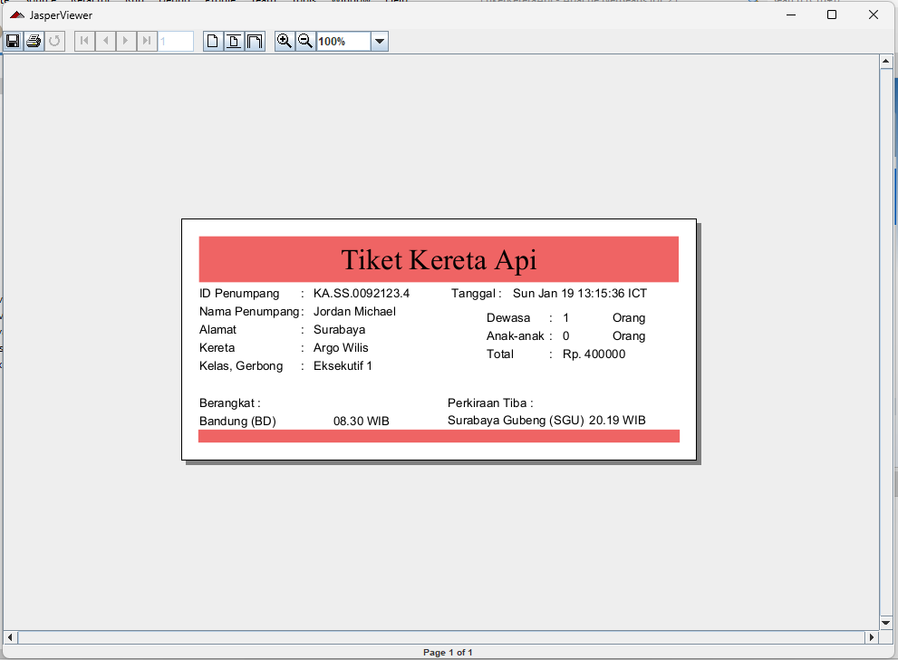
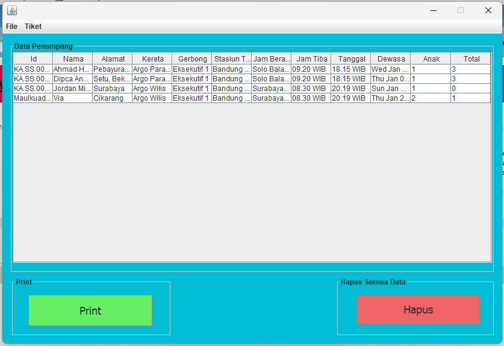
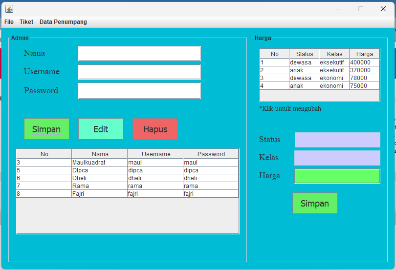

# Tiket Kereta Api SETSAT

|             |                        |     |
| ----------- | ---------------------- | --- |
| Nama        | Muhammad Rizqi Maulana |
| NIM         | 312210360              |
| Kelas       | TI.22.A.4              |
| Mata Kuliah | Pemrograman Visual     |

Projek ini merupakan aplikasi **Tiket Kereta Api** yang dikembangkan menggunakan **Java NetBeans** dan database **MySQL**. Aplikasi ini dirancang untuk mengelola proses pemesanan tiket kereta api, mulai dari login, input data tiket, pembayaran, hingga mencetak tiket dan mengelola data admin serta penumpang.

---

## Fitur Utama

1. **Form Login**
   - Autentikasi untuk pengguna aplikasi (Admin).

2. **Menu Utama**
   - Input data tiket kereta api.
   - Proses pembayaran tiket.
   - Data otomatis disimpan ke database.

3. **Form Admin**
   - CRUD data admin.
   - CRUD data harga tiket.

4. **Form Data Penumpang**
   - Menampilkan daftar penumpang yang telah selesai memesan tiket.

5. **Tampilan Cetak Tiket**
   - Tiket yang selesai dipesan otomatis dicetak untuk penumpang.

---

## Struktur File

- **`Admin.java`**
  - Mengelola fitur CRUD data admin dan harga tiket.
- **`Home.java`**
  - Tampilan menu utama aplikasi.
- **`Index.java`**
  - Entry point aplikasi.
- **`Koneksi.java`**
  - Koneksi ke database MySQL.
- **`Login.java`**
  - Validasi pengguna untuk masuk ke aplikasi.
- **`Penumpang.java`**
  - Mengelola data penumpang yang telah memesan tiket.

---

## Teknologi yang Digunakan

- **Java** (NetBeans IDE)
- **MySQL** sebagai database backend.
- **JDBC** untuk koneksi database.

---

## Screenshot Aplikasi

### 1. Form Login


### 2. Menu Utama


### 3. Tiket


### 4. Data Penumpang


### 5. Admin


---

## Cara Menjalankan Aplikasi

1. Clone repository ini ke lokal:
   ```bash
   git clone https://github.com/username/KA_SetSat.git
   ```

2. Import database **`01kereta_api.sql`** ke MySQL.

3. Buka project di NetBeans IDE.

4. Pastikan konfigurasi database pada `Koneksi.java` sesuai:
   ```java
   String url = "jdbc:mysql://localhost/01kereta_api";
   String user = "root";
   String pass = "";
   ```

5. Jalankan aplikasi dari file **`Index.java`**.

---

**Terima Kasih!** Selamat menggunakan aplikasi Tiket Kereta Api.
